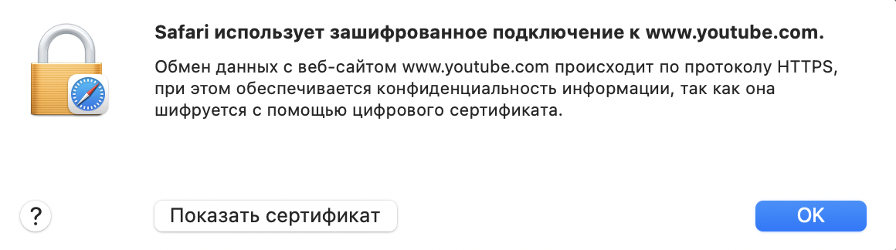
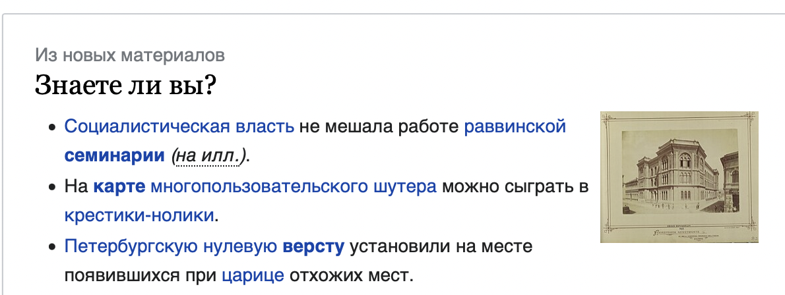
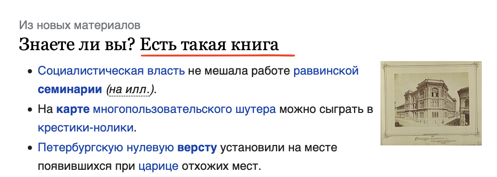
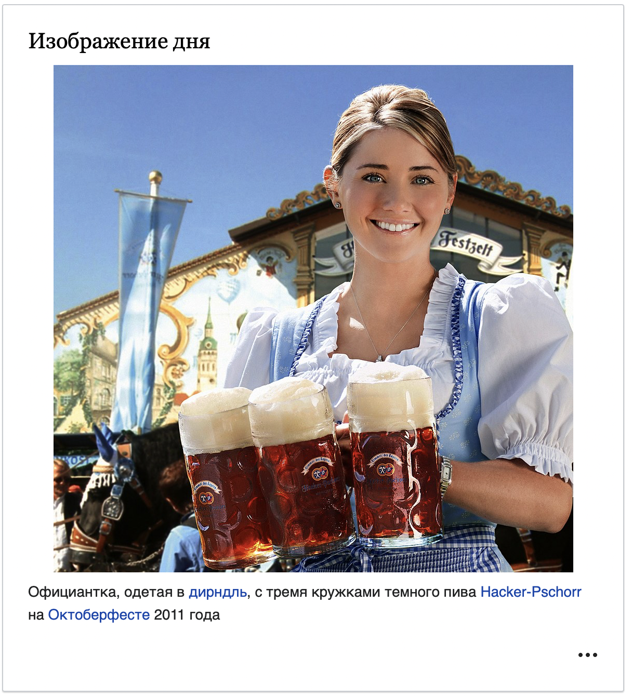
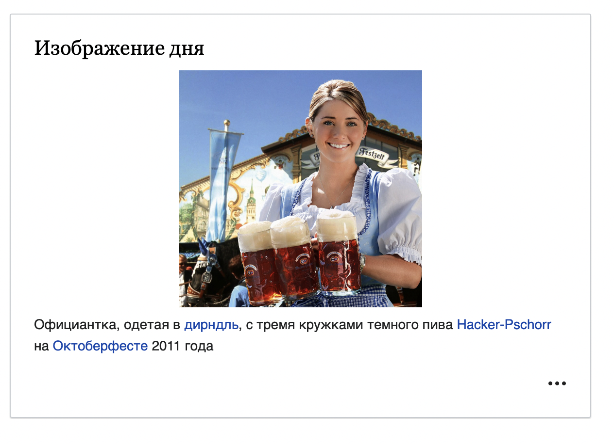
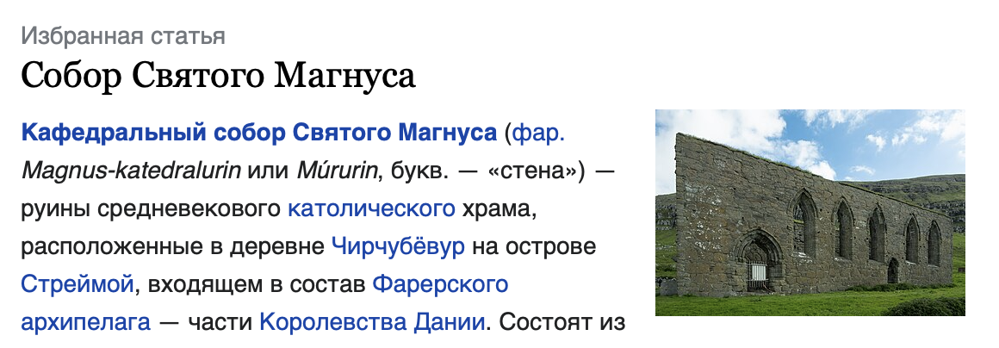
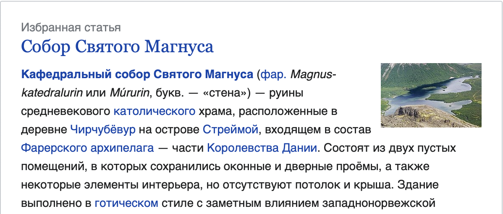

# HW1

### Задание 1
> Определите, на каком протоколе работает сайт youtube.com

**Ответ**: на https  

### Задание 2
> Проанализируйте структуру страницы сайта https://ru.wikipedia.org/, а именно нужно описать (коротко, своими словами), какие блоки есть на сайте, что в этих блоках находится. Есть ли на сайте шапка, подвал, что в них содержится? Как и где расположен контент? Есть ли дополнительные элементы на странице?

**Ответ:**
* header: в хедере находится навигация
* footer: футер на странице есть. Там находятся информационные ссылки
* основной контент находится в блоке *div[id="bodyContent"]*, который завернут в блок *div[id="content"]*. Сам контент находится в блоках div с классами *div[class="main-wrapper-column"]*
* на странице есть блок *div[class="main-wikimedia main-plainlist"]* с полезными ссылками, которые связаны с сайтом википедии

### Задание 3

> Внесите не менее 10 изменений на страницу любой статьи сайта https://ru.wikipedia.org/, с помощью инструмента разработчика и представьте два скриншота было/стало (скриншоты должны иметь названия 3_before.jpg, 3_after.jpg соответственно). Желательно поработать с изменением текста на странице, заменой картинки, изменением стилей

* изменение текста на странице

* изменение стиля на странице

* изменение изображения на странице

### Задание 3
